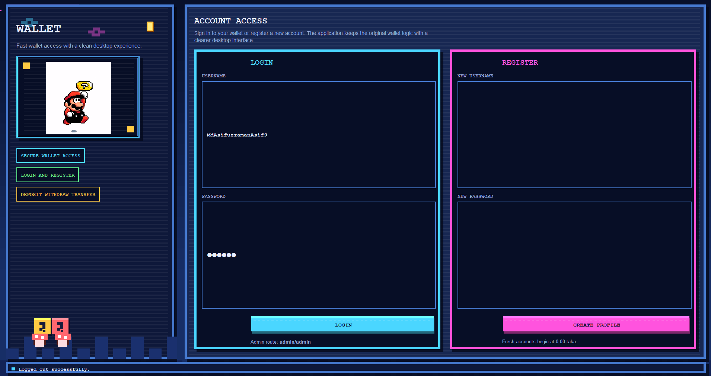

# Wallet

<div align="center">

A Java desktop wallet simulator with an enhanced Swing frontend for account management, money movement, file persistence, and object-oriented design.

<p>
  
  
  
  
  
</p>

</div>

---

## 🎨 User Interface Preview

Experience a unique retro-styled desktop interface designed with Java Swing. The application features a high-contrast, cyberpunk-inspired aesthetic that makes digital banking feel like a classic arcade experience.

### 🔐 Secure Access
<p align="center">
  
  <br>
  <em>The authentication hub provides a dual-panel layout for seamless login and registration, complete with retro pixel art and clear input fields.</em>
</p>

### 📊 Personal Dashboard
<p align="center">
  
  <br>
  <em>The main dashboard offers a centralized view of your account status, featuring balance summary cards, a real-time activity log, and a side-navigation menu for quick access to core features.</em>
</p>

---

## 🚀 Why this project is interesting

`Wallet` is a small but complete wallet workflow simulator built as a Java desktop application. It now includes an enhanced Swing-based frontend while still keeping the original file-based wallet logic underneath. Instead of focusing on heavy frameworks or databases, it concentrates on the fundamentals:

- user registration and authentication
- balance management
- deposits, withdrawals, and transfers
- transaction history tracking
- persistent storage through local files
- modular class design using Java OOP concepts
- desktop UI design with Java Swing

It works well as an academic project, a beginner Java portfolio piece, or a base for future upgrades such as database integration, security hardening, or GUI development.

---

## 💳 What the project does

The application simulates a lightweight digital wallet system where users can create accounts, sign in, move money, and inspect their balance history through a cleaner desktop dashboard.

### 👤 Main user actions

- **Register** a new wallet account
- **Log in** with username and password
- Use a **modern desktop dashboard** after login
- **Deposit** money after validating bank account details
- **Withdraw** money using a valid wallet booth number
- **Transfer** money to another registered user
- Check **current balance**
- View **transaction history**
- **Log out** safely with data written back to storage

### 🛡️ Admin view

The current implementation includes a simple built-in admin shortcut:

- Username: `admin`
- Password: `admin`

That admin login displays all registered users and their current wallet balances.

---

## ✨ Feature Highlights

- **Enhanced UI**: Java Swing frontend with dedicated auth and dashboard screens.
- **Visual Insights**: Balance summary cards and a cleaner desktop workflow.
- **Action Panels**: Separate panels for deposit, withdrawal, and transfer.
- **Activity Feed**: Real-time panel for tracking transaction history.
- **File Persistence**: Local storage via `account.txt` and `transactions.txt`.
- **Strict Validation**: Security checks for bank IDs, PINs, and booth numbers.
- **Internal Transfers**: Instant support between registered users.
- **OOP Architecture**: Modular class design using abstraction and inheritance.

---

## 🔄 How the wallet flow works

### Registration flow

When a new user registers:

1. The app asks for a username
2. It checks whether that username already exists
3. If valid, it creates a new user with a starting balance of `0.0`
4. The new account is saved immediately to file storage

### Login flow

When a user logs in:

1. The app reads previously saved users from local files
2. It validates the provided username and password
3. If matched, the user enters the wallet dashboard
4. If not matched, the login is rejected

### Deposit flow

To deposit money:

1. The user enters an amount
2. The app asks for a bank ID number and PIN
3. Those values are checked against `bank.txt`
4. If valid, the amount is added to the wallet balance and recorded in history

### Withdrawal flow

To withdraw money:

1. The user enters a wallet booth number
2. The booth number is checked against `WalletBooth.txt`
3. The user enters the withdrawal amount
4. The amount must be divisible by `100`
5. If the balance is sufficient, the amount is deducted and recorded

### Transfer flow

To transfer money:

1. The sender provides the recipient username
2. The app looks up the target user
3. The sender enters the transfer amount
4. If funds are sufficient, the balance is moved
5. Both sender and recipient transaction histories are updated

---

## How the code is organized

| Component | Responsibility |
|---|---|
| `App.java` | Main desktop application entry point |
| `WalletUI.java` | Swing frontend with login, registration, dashboard, and admin screens |
| `WalletService.java` | Reusable wallet business logic shared by the UI |
| `WalletResult.java` | Lightweight result model for UI-friendly action responses |
| `Account.java` | Abstract base account model with balance and transaction behavior |
| `SaveAccount.java` | Concrete account implementation connected to a user |
| `User.java` | Stores username, password, and account reference |
| `FileUtil.java` | Reads and writes users and transaction history from text files |
| `BankUtil.java` | Validates deposit credentials using bank data |
| `BankAccount.java` | Represents stored bank account information |
| `BoothUtil.java` | Validates withdrawal booth numbers |
| `Booth.java` | Represents a wallet booth entry |

---

## System design at a glance

The project now follows a straightforward desktop application architecture:

1. `App.java` launches the Swing application.
2. `WalletUI.java` manages the desktop frontend and screen transitions.
3. `WalletService.java` handles registration, login, deposit, withdrawal, and transfer rules.
4. `FileUtil.java` loads saved users and transaction history at startup.
5. Each `User` owns a `SaveAccount`, which inherits from `Account`.
6. `Account` centralizes balance updates and transaction logging.
7. `BankUtil` and `BoothUtil` validate external identifiers from text files.
8. After wallet actions, updated user and transaction data are written back to disk.

This makes the project easy to understand, extend, and present as a learning-focused Java system.

---

## 🛠️ Tech Stack

- **Language**: `Java`
- **UI Framework**: `Java Swing`
- **Build System**: `Apache Ant`
- **IDE Support**: `NetBeans project structure`
- **Storage**: `Plain text file persistence`

---

## 📂 Project Structure

```text
.
|-- src/
|   `-- wallettrial_2/
|       |-- App.java
|       |-- WalletUI.java
|       |-- WalletService.java
|       |-- WalletResult.java
|       |-- Account.java
|       |-- SaveAccount.java
|       |-- User.java
|       |-- FileUtil.java
|       |-- BankUtil.java
|       |-- BankAccount.java
|       |-- BoothUtil.java
|       `-- Booth.java
|-- test/
|-- nbproject/
|-- build.xml
|-- manifest.mf
|-- account.txt
|-- transactions.txt
|-- bank.txt
`-- WalletBooth.txt
```

---

## Data files used by the application

The application stores and validates data using plain text files in the project root.

| File | Purpose |
|---|---|
| `account.txt` | Stores `username,password,balance` for each registered user |
| `transactions.txt` | Stores transaction entries linked to usernames |
| `bank.txt` | Stores valid bank account number and PIN pairs |
| `WalletBooth.txt` | Stores valid wallet booth numbers |

This design keeps the project simple and easy to run without requiring a database server.

---

## 🚀 Getting Started

### 📋 Requirements

- JDK `8` or later
- Apache Ant

### 🏃 Run with Ant

```bash
ant clean
ant run
```

### 💻 Compile and run manually

```bash
javac -d build/classes src/wallettrial_2/*.java
java -cp build/classes wallettrial_2.App
```

---

## What this project demonstrates

### Java fundamentals

- classes and objects
- inheritance and abstraction
- encapsulation
- file input and output
- collections with `List`
- GUI event handling with Swing
- layered separation between UI and wallet logic

### Practical wallet concepts

- authentication checks
- stored balance updates
- transaction journaling
- external validation before credit and debit actions
- persistence across application restarts

---

## Current limitations

This project is functional, but it is still intentionally simple in several important ways:

- passwords are stored in plain text
- input parsing can fail on invalid numeric values
- there is no encryption or secure credential handling
- the admin credentials are hardcoded
- data is stored in text files instead of a database
- there is no automated testing or CI setup yet
- the app uses local Swing UI and is not built for production use

These limitations are normal for a learning-oriented project and also create clear opportunities for future improvement.

---

## Future improvement ideas

- hash and salt passwords before storage
- move from text files to MySQL, PostgreSQL, or SQLite
- add stronger validation and exception-safe input handling
- support account deletion and password updates
- add transaction timestamps
- add richer charts, icons, and visual reporting to the current UI
- add unit tests for account and file utility behavior
- add role-based admin features and better reporting

---

## Best use cases

- Java OOP coursework
- beginner file-handling projects
- simple wallet simulation demos
- portfolio repositories for Java fundamentals
- starting point for a larger fintech-style academic system

---

## Author

**MdAsifuzzaman9**

---

## License

This project is licensed under the MIT License. See [LICENSE](LICENSE) for details.
